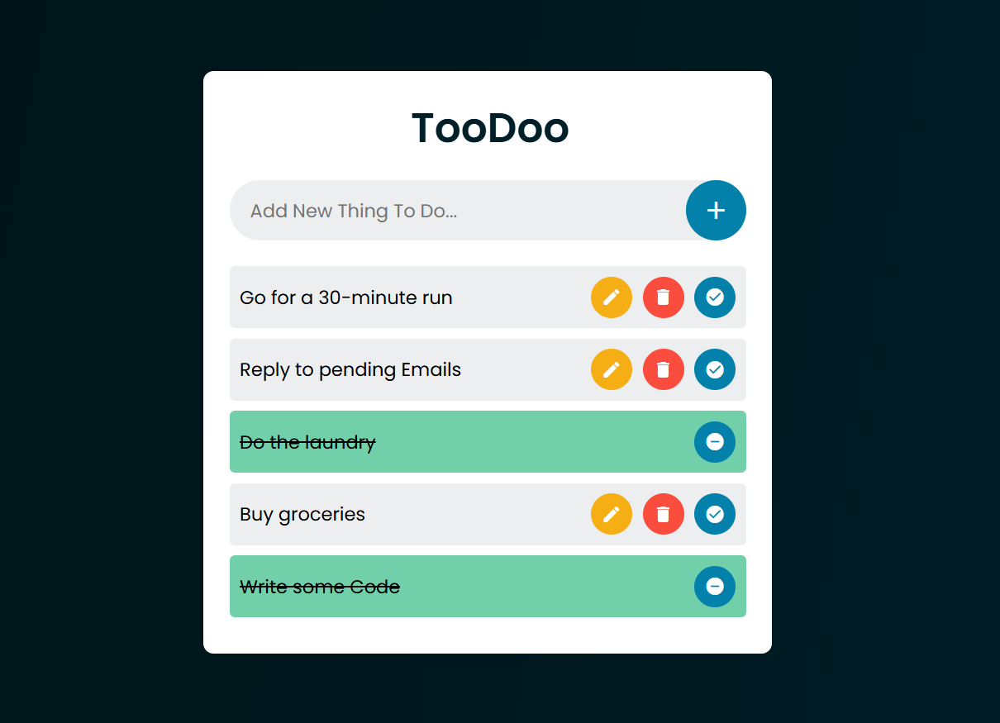

# "TooDoo" To-Do List Web App
**Java Spring Boot - Web Application Project**
> A lightweight task management web app built with Java Spring Boot, allowing users to create, edit, delete, and view tasks effortlessly with a user-friendly UI.

## System Architecture 📐
#### This project follows a Layered Architecture to ensure clean separation of concerns and maintainability:
- Controller Layer 🎯 – Handles HTTP requests and responses
- Service Layer ⚙️ – Implements business logic.
- Repository Layer 🗄️ – Manages database operations.
- Model Layer 📄 – Defines the data structure.

## Built With ⚡️
- Java Langugae
- Spring Boot
- H2 Database
- Thymeleaf
- HTML & CSS
- Javascript
- Maven
- Postman Tool
- VSCode IDE

## Project Preview 👀

## Authors

👤 **Yousef Hussien**
- Github: [@yousefhussien727](https://github.com/yousefhussien727)
- Linkedin: [/in/yousefhussien](https://www.linkedin.com/in/yousefhussien/)

## Show your support ❤
Give a ⭐️ if you like this project!

## License 📝
This project is [MIT](./LICENSE.txt) licensed.
